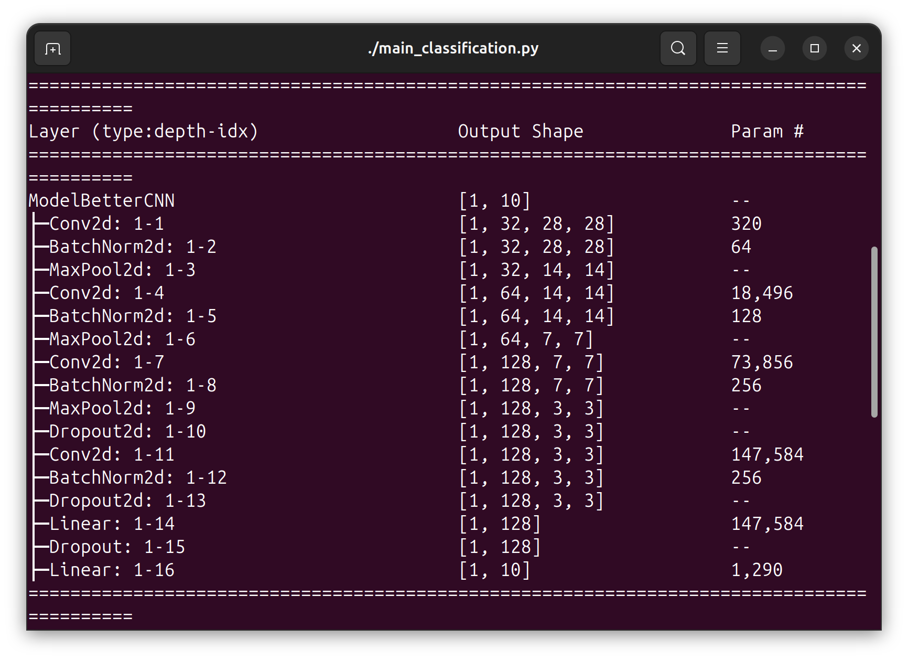
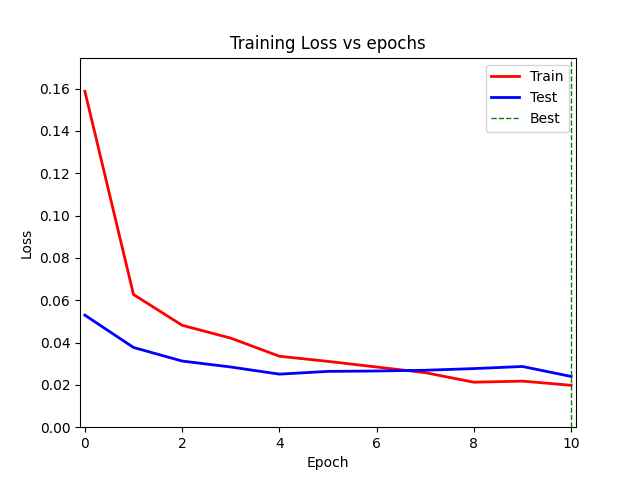
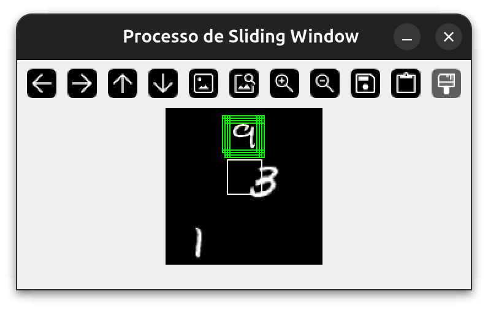
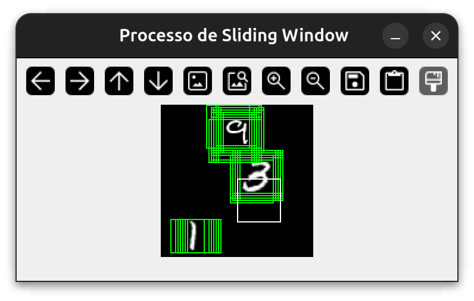
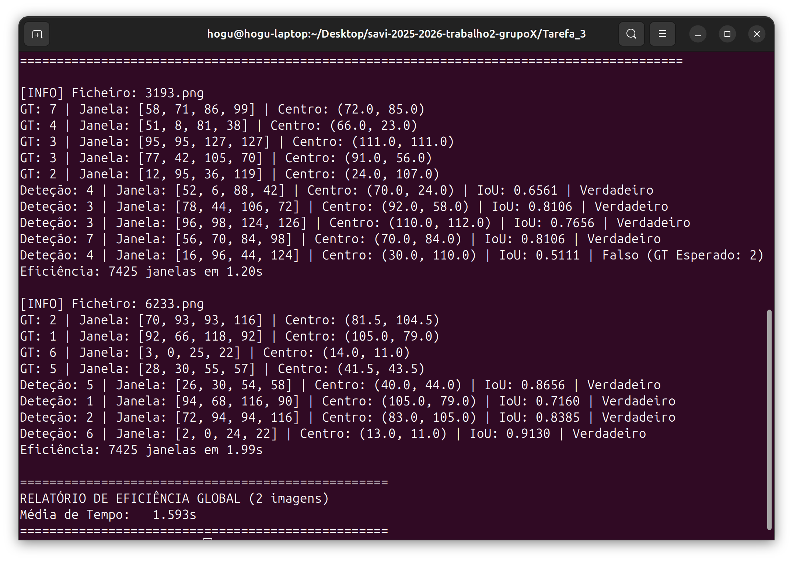
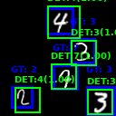
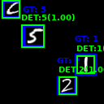

# savi-2025-2026-trabalho2-grupoX
Classificação e Deteção de Dígitos Manuscritos com Redes Neuronais Convolucionais

O trabalho foca-se na aprendizagem profunda (Deep Learning). O objetivo é evoluir de um problema de classificação simples (MNIST clássico) para um cenário mais realista e complexo: a deteção e classificação de múltiplos objetos em imagens maiores.

Neste projeto, consolidam-se os conhecimentos sobre PyTorch, arquiteturas CNN (Convolutional Neural Networks), métricas de avaliação e técnicas de deteção de objetos. O trabalho evolui incrementalmente desde a otimização de um classificador até à implementação de um detetor de objetos completo.

Para a execução do código desenvolvido, são necessárias as seguintes bibliotecas:

torch torchvision numpy matplotlib seaborn wandb tqdm pillow colorama torchinfo scikit-learn requests opencv-python pandas 

--------------------------------------------------
Tarefa 1: Classificador CNN Otimizado (MNIST Completo)

A Tarefa 1 consiste no desenvolvimento e treino de um classificador de dígitos manuscritos utilizando o dataset MNIST e redes neuronais. Primeiramente, foi alterada a classe Dataset. Esta classe é responsável por carregar as imagens de treino e teste a partir das pastas organizadas e ler os ficheiros de etiquetas. As imagens são depois convertidas para tensores e normalizadas para serem processadas pela rede, onde foi aumentado o número de imagens para treino e teste. 
De seguida, na classe model, foram desenvolvidas duas arquiteturas distintas para comparação: a ModelFullyconnected simples (desenvolvida na aula) e a ModelBetterCNN. Esta última foi a arquitetura escolhida para os resultados finais por ser consideravelmente mais robusta, totalizando 389 322 parâmetros. A ModelBetterCNN é constituída por vários blocos de convolução (Conv2d), seguidos de normalização (BatchNorm2d), ativação (ReLU) e pooling (MaxPool2d). Para evitar o overfitting num modelo desta complexidade, foram também introduzidas camadas de Dropout antes das camadas lineares finais.

*Estrutura detalhada da rede ModelBetterCNN.*

Durante o treino, utilizou-se a ferramenta wandb (Weights & Biases) para monitorizar em tempo real a evolução da perda. Por fim, após o treino, foi realizada a avaliação do modelo no conjunto de teste. 

*Curvas de evolução da Loss durante o processo de treino.*

O algoritmo calcula métricas detalhadas como Precisão, Recall e F1-Score para cada classe (dígitos 0-9), guardando os resultados num ficheiro JSON  e num [relatório de texto](datasets/savi_experiments/Tarefa_1_ModelBetterCNN/metrics_summary.txt), obtendo métricas globais de Precisão de 0.9934, Recall de 0.9934 e F1-Score de 0.9934. Adicionalmente, gerou-se uma Matriz de Confusão utilizando a biblioteca seaborn para visualizar graficamente os erros de classificação e identificar quais os dígitos que a rede confunde com maior frequência.

*Matriz de Confusão resultante do modelo CNN.*

--------------------------------------------------
Tarefa 2: Geração de Dataset de "Cenas" com Dígitos

A tarefa 2 consistiu na criação de um dataset mais complexo, onde os dígitos deixam de estar centrados e normalizados, passando a estar espalhados por imagens de maiores dimensões (128x128). O objetivo principal foi simular um cenário real de deteção de objetos, onde é necessário lidar com múltiplos dígitos, posições aleatórias e diferentes escalas. Para tal, alterou-se a ferramenta MNIST-ObjectDetection, corrigindo a sobreposição de dígitos nas imagens geradas ao reduzir o valor comparado com o ious (intersection over union). O processo de geração permitiu criar quatro variantes do dataset para análise comparativa: a Versão A (-vA), com apenas um dígito com posição aleatória; a Versão B (-vB), introduzindo variações de escala (entre 22x22 e 36x36 pixels); a Versão C (-vC), com múltiplos dígitos (3 a 5) por imagem com escala fixa (28x28 pixels); e a Versão D (-vD), combinando múltiplos dígitos (3 a 5) com variações de escala (entre 22x22 e 36x36 pixels). Durante a geração, o algoritmo verifica a intersecção das caixas delimitadoras para garantir que os dígitos não se sobrepõem.
Para validar a qualidade do dataset, ao correr o código main_dataset_stats.py -vs, é ativado o código responsável por realizar uma análise estatística completa, gerando histogramas da distribuição de classes e calcular métricas como o tamanho médio dos dígitos e a frequência de objetos por imagem. Adicionalmente, o código gera um mosaico onde as imagens são apresentadas com as respetivas caixas delimitadoras (bounding boxes) desenhadas, permitindo confirmar visualmente.

*Número de dígitos por imagem.*

*Tamanho médio dos dígitos.*

*Distribuição de Classes.*

*Mosaicos de imagens.*

--------------------------------------------------
Tarefa 3: Deteção por Janela Deslizante (Sliding Window)

A Tarefa 3 teve como objetivo a implementação de um sistema de deteção de objetos utilizando o classificador treinado na Tarefa 1 para localizar dígitos nas cenas complexas geradas na Tarefa 2. Uma vez que o modelo original foi treinado apenas para classificar dígitos centrados e não possui uma classe de fundo (background), a abordagem de janela deslizante foi utilizada para percorrer exaustivamente a imagem de entrada (128x128) à procura de padrões conhecidos.
O código percorre a imagem utilizando janelas de diferentes escalas (22, 28 e 36 pixels) e um passo (stride) definido pelo utilizador. Para cada janela capturada, o sistema realiza um pré-processamento para verificar se a zona contém informação relevante, evitando processar áreas vazias e se o dígito está centrado na janela. Os recortes são então redimensionados para 28x28 e passados para a rede ModelBetterCNN. Para filtrar os falsos positivos, foi aplicado um limiar de confiança (threshold) de 99% na saída do Softmax. Para resolver o problema de múltiplas deteções sobre o mesmo objeto, implementou-se um algoritmo de Non-Maximum Suppression (NMS), que seleciona apenas a caixa com maior confiança entre deteções sobrepostas.
Em termos de eficiência, a abordagem de janela deslizante revelou-se computacionalmente exigente, analisando 7425 janelas por imagem com um passo de 2, com tempos de execução a rondar 1.6 segundos por imagem.
Sendo possível detetar apenas uma imagem ou um número defenido de imagens retiradas da pasta de forma aleatório (-n x), é ainda possível ativar a visualização da janela deslizante para cada um dos casos (-vs).

*Exemplo deteção por janela deslizante.*

*Resultado janela deslizante, imagem 3193 e 6233.*

*Resultado imagem 3193.*

*Resultado imagem 6233.*

--------------------------------------------------
Tarefa 4: Detetor e Classificador Integrado

A Tarefa 4 representa a evolução final do projeto, focando-se na implementação de uma Fully Convolutional Network (FCN) para a deteção eficiente de números manuscritos, superando as limitações computacionais da abordagem de Janela Deslizante explorada anteriormente. O objetivo central foi transformar o classificador da Tarefa 1 numa rede capaz de processar imagens de dimensões arbitrárias numa única passagem (forward pass), gerando mapas de probabilidade espacial para a localização dos dígitos. A metodologia adotada baseou-se fortemente em Transfer Learning, reaproveitando os pesos e o conhecimento do modelo ModelBetterCNN treinado na Tarefa 1. A arquitetura original foi adaptada removendo as camadas densas (Fully Connected) e substituindo-as por camadas convolucionais 1x1, preservando assim a informação espacial. Adicionalmente, a camada de saída foi ajustada para suportar 11 classes, introduzindo uma classe específica para o "Fundo" (Background), essencial para que a rede aprenda a distinguir ativamente entre zonas de interesse e áreas vazias. Para o treino, foi gerado um dataset misto (mixed_dataset) composto por "patches" de 28x28 píxeis contendo tanto dígitos como fundos aleatórios. Um fator crítico para o sucesso do modelo foi a implementação de técnicas de Data Augmentation no script dataset.py, aplicando rotações e variações de escala aleatórias às imagens de treino. Esta estratégia, combinada com a inicialização via Transfer Learning, permitiu uma convergência rápida da função de perda (Loss) e dotou o modelo de uma elevada capacidade de generalização, evitando o overfitting à classe de fundo. 

*Curvas de evolução da Loss.*

O processo de inferência final é realizado pelo script main_fcn_detection.py, que submete a imagem completa à rede e processa o mapa de calor resultante. Para filtrar as múltiplas ativações geradas por um único objeto, aplicou-se um algoritmo de Non-Maximum Suppression (NMS) com limiares ajustados, que elimina deteções sobrepostas e redundantes. Os resultados obtidos demonstram uma melhoria drástica na velocidade de processamento face à Tarefa 3, mantendo uma precisão elevada na identificação e classificação dos dígitos. 

*Resultado da imagem 85 da pasta test da versão D da Tarefa 2.*
