# savi-2025-2026-trabalho2-grupoX
Classificação e Deteção de Dígitos Manuscritos com Redes Neuronais Convolucionais

# SAVI_Trabalho_prático_1
Trabalho prático 1 

O objetivo do trabalho prático 1 foi a familiarização dos estudantes com objetos do tipo point cloud, desde a sua "construção", tratamento com algoritmo ICP (iterative closest point) e desenvolviemnto do prórpio algoritmo costumizado. 

Para execução é necessário as seguintes bibliotecas:
open3d matplotlib numpy pyvista pyvistaqt PyQt5

Tarefa 1:

A tarefa 1 consiste na criação de 2 point clouds através de imagens rgbd (rgb + depth) e posterior alinhamento através do algoritmo ICP. Para isso usaram-se as funções da livraria open3d. Primeiramente leram-se 2 pares de imagens constituídos por 1 imagem rgb e outra imagem de profundidade (depth). Através da função "o3d.geometry.RGBDImage.create_from_tum_format" foi possível criar as imagens rgbd e de seguida utilizando "o3d.geometry.PointCloud.create_from_rgbd_image", as imagens anteriores e parâmetros de câmara default criaram-se as point clouds.
Antes do alinhamento, foi feita uma fase de pré-processamento das nuvens de pontos, onde se aplicou downsampling e cálculo das normais locais, além da extração das características FPFH (Fast Point Feature Histograms), utilizadas no método de Fast Global Registration para identificar correspondências entre as duas nuvens. Também se gravaram estas point clouds como ficheiros .ply para um posterior pré-alinhamento no software CloudCompare. Para diminuir o esforço computacional assim como o tempo de execução do algoritmo foi realizado uma diminuição da densidade dos pontos com um parâmetro de 0,025. Foi criada uma função para fazer o display das 2 nuvens de pontos transformadas por uma matriz de transformação. Estas funções foram usadas ao longo do código para visualizar o processo de alinhamento. Alternativamente, foi também testado o método de Fast Global Registration (FGR) fornecido pela Open3D. Este método calcula uma transformação inicial automática com base nas características FPFH das duas nuvens de pontos, permitindo obter um alinhamento inicial aproximado sem necessidade de software externo. Em seguida aplicou-se a função ICP point to point. Esta função toma como argumentos 2 point clouds, a fonte, que vai ser alterada, e a alvo, que serve como referência. Recebe também uma distância máxima a que os pontos devem estar para ser aplicado o método, uma matriz de transformação inicial (obtida por CloudCompare ou então por FastGlobalRegistrationOption, sendo que esta última apenas alinha as nuvens grosseiramente) e o número máximo de iterações caso não se atinja convergência. O algoritmo ICP ponto a ponto procura para cada ponto na nuvem de pontos fonte, o ponto a menor distância euclidiana da nuvem de pontos alvo. Se a distância fôr maior que o limite definido a correspondência não é considerada. De seguida o algoritmo calcula o centróide dos pontos correspondidos na nuvem alvo, e faz a translação do centróide da nuvem fonte para coincidir com o anterior. O segundo passo é minimizar a distância medida anteriormente, por meio da rotação da nuvem alvo, de modo que a média da distância euclidiana entre os pontos seja mínima. Estes passos são repetidos até se obter convergência satisfatória. Posteriormente, aplicou-se também o método ICP point to plane. Este método é uma variação do anterior, mas em vez de minimizar a distância direta entre pontos correspondentes, minimiza a distância de cada ponto da nuvem fonte ao plano definido pela normal do ponto (calculado anteriormente) correspondente na nuvem alvo. Este método tende a convergir mais rapidamente e com maior precisão quando as nuvens já estão razoavelmente alinhadas. Por fim, foi desenvolvida uma pequena interface gráfica com o PyVista para visualição de cada etapa do alinhamento (inicial, pré-alinhamento, FGR, ICP point-to-point e ICP point-to-plane), com a possibilidade de alteração das cores para maior contraste. Esta visualização foi integrada com a livraria PyQt5 que permite criar janelas interativas para seleção de modos de cor e etapas.

 

*Interface principal do visualizador, com os botões para alternar etapas e cores.*

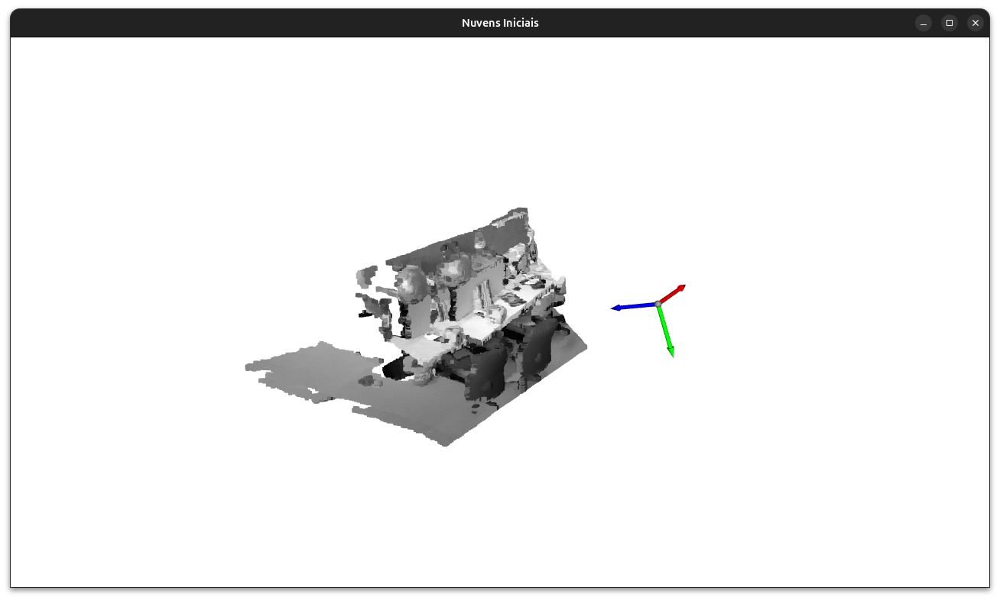 
*Visualização das nuvens de pontos iniciais obtidas a partir das imagens RGB-D.*

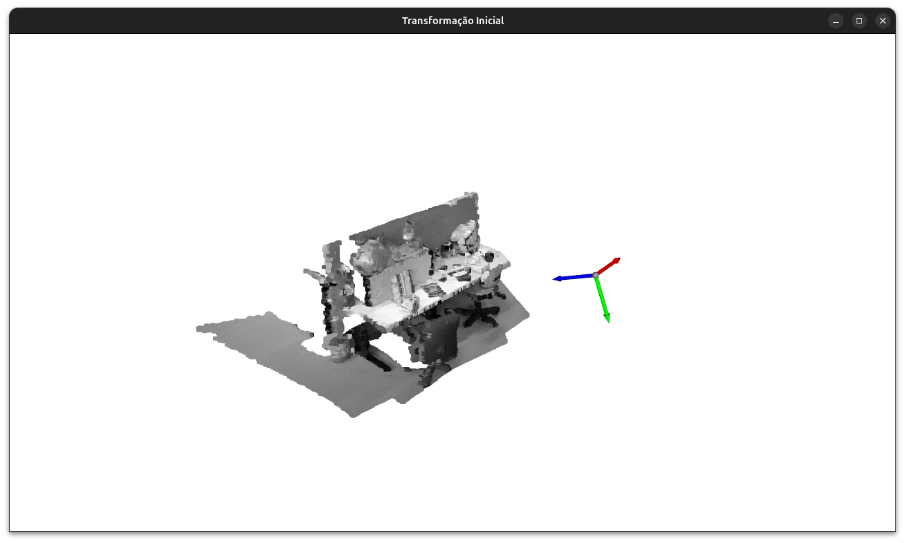 
*Aplicação da transformação inicial obtida no CloudCompare.*

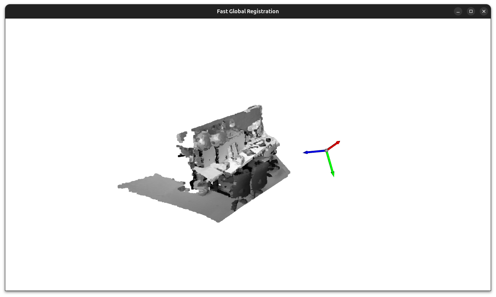 
*Resultado do alinhamento inicial usando Fast Global Registration.*

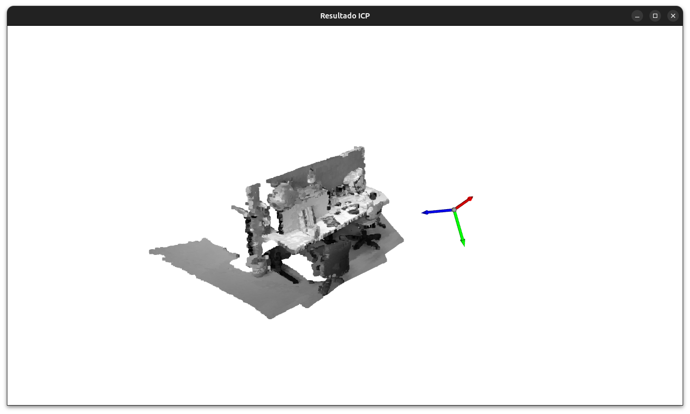 
*Alinhamento refinado usando ICP Point-to-Point.*

 
*Alinhamento final usando ICP Point-to-Plane.*

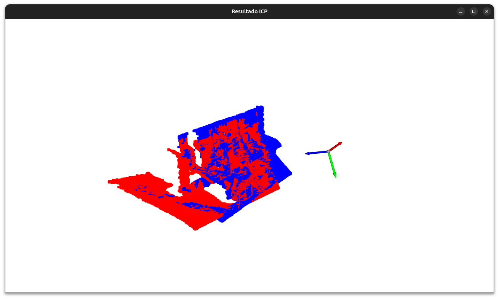 
*Visualização da mesma etapa com diferentes esquemas de cores para distinguir nuvem fonte e alvo.*

Tarefa 2:

A tarefa 2 consiste na implementação de um ICP personalizado com otimização utilizando scipy.optimize.least_squares e inicialização manual. A parte inicial do processamento é idêntica à descrita na Tarefa 1.
Nesta tarefa, foi definida uma transformação inicial manual, obtida através do alinhamento aproximado no CloudCompare. O ciclo ICP personalizado foi implementado através de uma função objetivo que recebe como parâmetros um vetor de seis elementos (três rotações e três translações). Em cada iteração, para cada ponto da nuvem fonte, é encontrado o vizinho mais próximo na nuvem alvo utilizando o3d.geometry.KDTreeFlann. A função de custo calcula a soma das distâncias ao quadrado entre pontos correspondentes, retornando os resíduos individuais de cada ponto, sendo utilizado apenas uma percentagem dos valores mais baixos, de modo a não ter em conta pontos sem correspondência. A otimização incremental é então realizada com scipy.optimize.least_squares, ajustando os parâmetros de transformação de forma a minimizar os resíduos. A transformação estimada é aplicada à nuvem fonte em tempo real, permitindo acompanhar visualmente a evolução do ICP.
Apesar de o ICP personalizado conseguir iniciar a convergência mesmo quando as nuvens estão relativamente distantes, a precisão final do alinhamento tende a ser limitada. Mesmo quando a inicialização é próxima, o método tende a não atingir exatamente a mesma precisão do ICP nativo, devido à presença de mínimos locais na função de custo e à existência de pontos na nuvem que não apresentam correspondência um-para-um.
Para a visualização, foi utilizada a função VisualizerWithKeyCallback, permitindo observar em tempo real a evolução da otimização. Foram definidos diferentes esquemas de cores, controlados com a tecla 'C', incluindo a opção de restaurar as cores reais das nuvens com a tecla 'R'. Por fim, foi desenvolvida a interface gráfica com PyQt5 que permite visualizar as diferentes etapas.

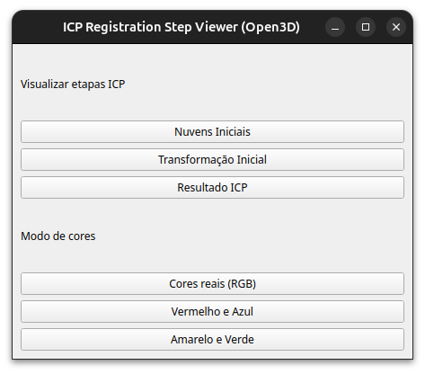 

*Interface principal do visualizador, com os botões para alternar etapas e cores.*

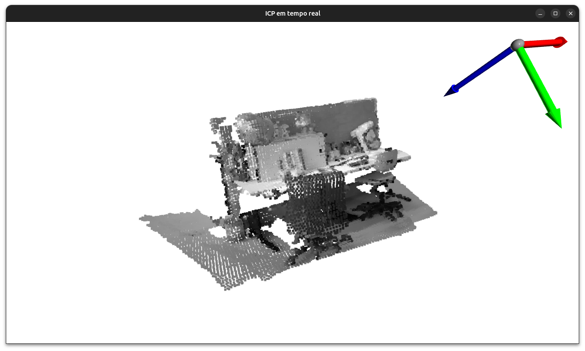 
*ICP no processo de otimização.*

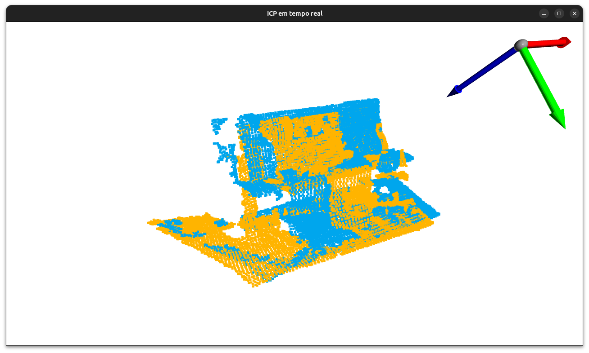 
*ICP no processo de otimização com esquema de cores.*

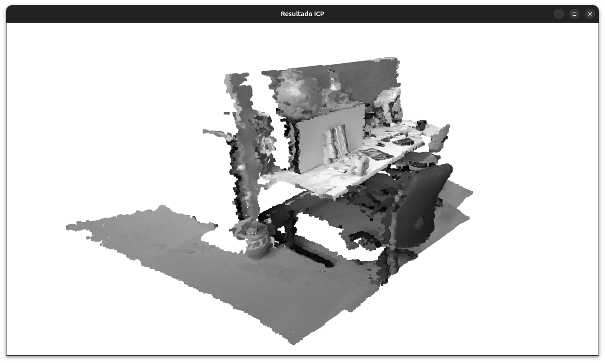 
*Alinhamento final usando ICP personalizado.*

Tarefa 3:

A tarefa 3 consiste na otimização de uma esfera englobante que reúne a posição e o raio que melhor contém as duas nuvens de pontos, com visualização em tempo real do processo de otimização. A parte inicial do processamento é idêntica à descrita na Tarefa 1.
O cṍdigo tenta primeiro carregar, quando disponível, uma transformação previamente estimada (ficheiro output_opti.txt) e aplica-a à nuvem fonte, caso contrário usa a nuvem na sua posição inicial. A partir das duas nuvens é construída uma nuvem combinada usada para estimar os parâmetros iniciais da esfera (centro da esfera é definido no centróide da nuven de pontos e o raio corresponde à distância máxima entre o centróide e os pontos). A esfera é representada por uma point cloud gerada aleatoriamente sobre a superfície, permitindo mostrar graficamente a esfera em cada iteração.
A função objetivo define o erro como a soma dos excessos das distâncias dos pontos ao raio mais um erro que penaliza o tamanho do raio. A otimização é executada com scipy.optimize.least_squares (em paralelo), enquanto a aplicação atualiza em tempo real a point cloud da esfera, permitindo acompanhar a evolução dos parâmetros.
A interface da otimização permite controlar com a tecla 'C' o esquemas de cor da esfera. Após a conclusão da otimização os parâmetros finais (centro e raio) são guardados em output_opti_sphere.txt e é construído um menu final em PyQt5 permite visualizar as diferentes etapas.

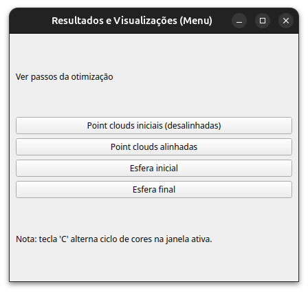 

*Interface principal do visualizador.*

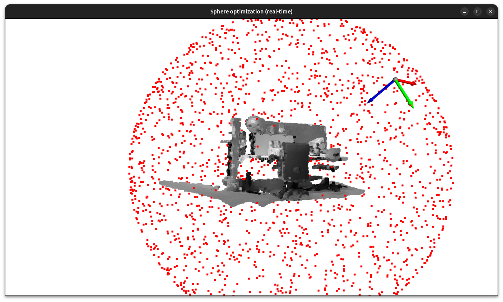 
*Processo de otimização dos parâmetros da esfera englobante.*

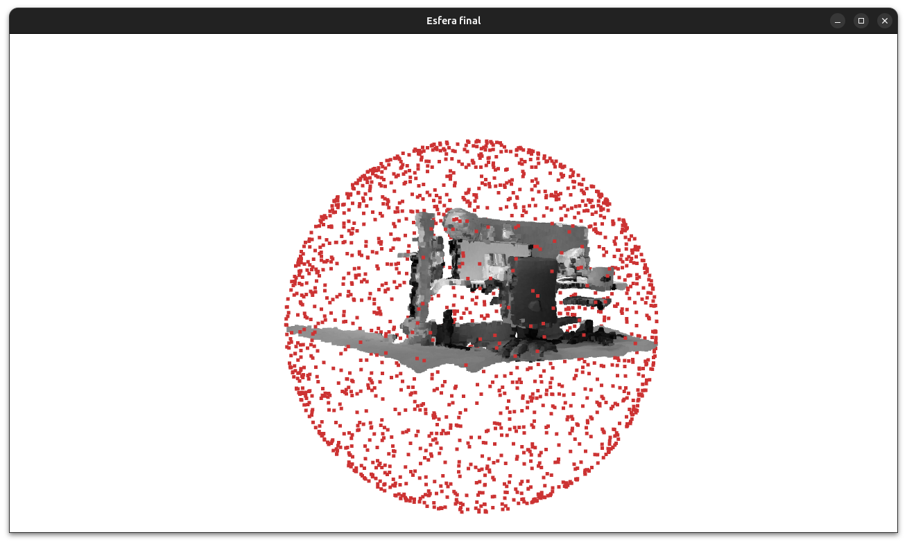 
*Esfera englobante otimizada.*
